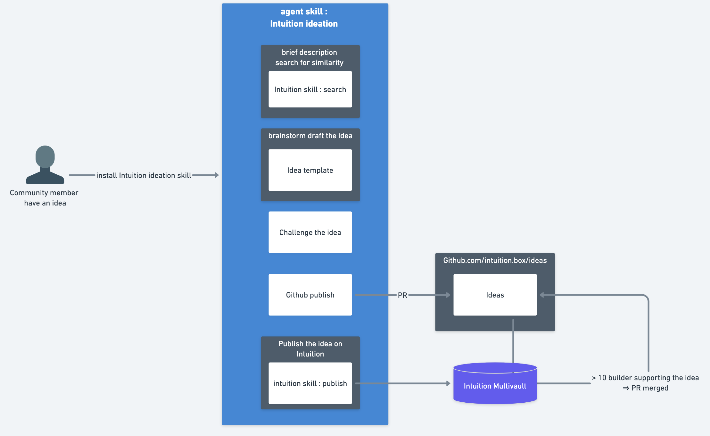

# Intuition Ideation Skill

A [Claude Code](https://docs.anthropic.com/en/docs/agents-and-tools/claude-code/overview) skill that guides users through brainstorming, structuring, and publishing product ideas for the [Intuition Protocol](https://intuition.systems) ecosystem.



## What It Does

This skill walks non-technical community members through a **5-step conversational workflow**:

1. **Describe & Search** — Capture the idea and search for similar concepts in the Intuition knowledge graph
2. **Brainstorm & Draft** — Structure the idea into a standardized template through guided conversation
3. **Challenge** — Stress-test the idea from feasibility, market, protocol-fit, and UX angles
4. **Publish to GitHub** — Create a PR on the [intuition-box/ideas](https://github.com/intuition-box/ideas) repo
5. **Publish on Intuition** — Create an on-chain atom and claim via the Intuition Protocol

## Installation

```bash
npx skills add intuition-box/intuition-ideation-skill
```

## Dependencies

| Dependency | Required For | Install |
|-----------|-------------|---------|
| [Intuition Protocol Skill](https://github.com/0xIntuition/agent-skills) | Step 5 (on-chain publishing) | `npx skills add 0xintuition/agent-skills --skill intuition` |
| [GitHub CLI](https://cli.github.com/) | Step 4 (GitHub PR) | `brew install gh` + `gh auth login` |

> Steps 1–4 work without the Intuition Protocol skill. The minimum viable path is Step 2 (draft) → Step 4 (GitHub publish).

## Usage

Once installed, the skill triggers automatically when you say things like:

- *"I have an idea for something that could use Intuition"*
- *"Let's brainstorm a product concept"*
- *"I want to submit an idea to intuition-box"*
- *"New idea for the protocol"*

## Skill Structure

```
.claude/skills/intuition-ideation/
├── SKILL.md                              # Main skill definition
├── assets/
│   └── workflow-overview.png             # Visual overview of the 5-step workflow
└── references/
    ├── intuition-protocol-skill.md       # Full Intuition Protocol context (loaded at bootstrap)
    ├── intuition-basics.md               # Plain-English protocol explainer
    ├── idea-template.md                  # Structured idea template
    └── github-submission-format.md       # GitHub PR format spec
```

## How It Works

The skill bootstraps by loading the full [Intuition Protocol skill](https://github.com/0xIntuition/agent-skills/blob/main/skills/intuition/SKILL.md) as context, giving it deep knowledge of atoms, triples, vaults, GraphQL queries, ABI fragments, and network configuration. This enables it to:

- Search the Intuition knowledge graph for similar ideas (Step 1)
- Suggest realistic protocol integration patterns (Step 2)
- Evaluate feasibility against actual protocol capabilities (Step 3)
- Guide on-chain publishing with correct transaction parameters (Step 5)

All technical details are translated into plain English for non-technical users.

## Contributing

Ideas and improvements welcome! Open an issue or PR.

## License

MIT
